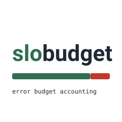

# SloBudget

<blockquote align="center">

error budget = (1 - objective) x total events

consumed = bad events / error budget

burn rate = observed failure ratio / (1 - objective)

</blockquote>

SloBudget is an error budget calculator for service level objectives. You give
it a service level indicator series, being good events and total events per
interval, a declared objective such as 99.9 percent, and a compliance window
such as 30 days. It reports the error budget, how much of it the observed
failures have already spent, the burn rate over several windows, and a
conditional projection of when the budget runs out if the current rate holds.
It also evaluates the multi window fast-burn and slow-burn alert pair and says
which condition would have fired and at which timestamp.

The tool is written for the moment after an incident when someone asks how much
budget the incident cost and whether the paging alert should have fired. It
answers from the recorded numbers, and it refuses to answer when the data does
not support an answer.



<br clear="left"/>

SloBudget is Python 3.11 and the standard library only. No third party runtime
dependencies, no network access, no wall-clock reads in its output. Given the
same input bytes it prints byte identical output, so two runs diff cleanly in
git.

## Why error budgets

An availability objective of 99.9 percent is a promise that at most 0.1 percent
of events may fail over the compliance window. That 0.1 percent is not a target
to hit, it is a budget to spend. Every failed request draws the budget down. As
long as the budget is not exhausted, the service is meeting its objective, and
the team is free to ship. When the budget is gone, the objective is missed, and
the sensible response is to stop shipping risk and stabilise.

The hard questions are not the definition, they are the accounting. How much of
the budget did last night's incident actually cost. At the current failure
rate, how long until the budget is gone. Should the fast paging alert have
fired, or only the slower ticket. SloBudget computes each of these from the
recorded indicator series, and it is explicit about the assumptions each answer
rests on.

## Install and run

The project uses a src layout with a console script entry point. You can run it
without installing by putting the package on the path:

```
PYTHONPATH=src python -m slobudget version
```

Captured output:

```
slobudget 0.1.0
```

An editable install exposes the `slobudget` command directly:

```
pip install -e .
slobudget version
```

## The input format

The indicator series is line oriented so it diffs cleanly and is easy to
generate from a query. Each data row is a timestamp, a good count, and a total
count:

```
2026-03-01T00:00:00Z,1999,2000
2026-03-01T00:05:00Z,1998,2000
```

Rules the parser enforces:

- The timestamp is ISO 8601. A trailing `Z` or an explicit offset is accepted,
  and everything is normalised to UTC.
- The timestamp marks the start of a fixed length interval. The interval length
  is inferred from the first two rows and every later step must be a whole
  multiple of it.
- good and total are non negative integers, and good may not exceed total.
- Blank lines and lines starting with `#` are ignored.
- A step that is a multiple of the interval greater than one is recorded as a
  gap, not an error. A step that is not a whole multiple is an error.

Rows may arrive out of order. The parser sorts them by timestamp and rejects
duplicates.

## Commands

| Command   | Purpose                                                        |
| --------- | -------------------------------------------------------------- |
| `budget`  | Compute the error budget and the fraction consumed so far.     |
| `burn`    | Burn rates over several windows and a conditional projection.  |
| `alerts`  | Evaluate the fast-burn and slow-burn multi window pair.        |
| `version` | Print the package version.                                     |

Every command that reads a series takes two options:

| Option              | Default | Meaning                                       |
| ------------------- | ------- | --------------------------------------------- |
| `--objective`, `-o` | `99.9`  | Target success ratio: `99.9`, `99.9%`, `0.999`. |
| `--window`, `-w`    | `30d`   | Compliance window: `30d`, `1w`, `24h`, `300`.   |

## Worked example

The repository ships `samples/service-a.sli`, a four hour series at five minute
intervals with 2000 events per interval. It starts healthy, takes a sharp thirty
minute incident at 11 percent failure, recovers over the next thirty minutes,
then runs clean for two hours. It totals 96000 events with 1536 bad.

Read the budget against a 98 percent objective over a 30 day window. The command
and its verbatim output:

```
PYTHONPATH=src python -m slobudget budget samples/service-a.sli -o 98 -w 30d
```

```
error budget report
  objective            98.000% success
  compliance window    30d
  allowed failure      2.000%
  total events         96000
  bad events           1536
  observed failure     1.600%
  budget (events)      1920.000
  budget consumed      80.000%
  budget remaining     20.000%
  remaining events     384.000
  status               within budget
```

The incident and the trickle of background failures together spent 80 percent
of the budget. Twenty percent remains. The exit code is 0 because the budget is
not exhausted.

Now read the same series against the tighter 99.9 percent objective:

```
PYTHONPATH=src python -m slobudget budget samples/service-a.sli -o 99.9 -w 30d
```

```
error budget report
  objective            99.900% success
  compliance window    30d
  allowed failure      0.100%
  total events         96000
  bad events           1536
  observed failure     1.600%
  budget (events)      96.000
  budget consumed      1600.000%
  budget remaining     0.000%
  remaining events     -1440.000
  status               EXHAUSTED, budget is spent
```

At 99.9 percent the budget is only 96 events, and the incident alone blew
through it many times over. Consumption reads 1600 percent, remaining events is
negative, and the exit code is 1.

## The budget report field by field

| Field              | Meaning                                                          |
| ------------------ | ---------------------------------------------------------------- |
| `objective`        | The target success ratio you passed, echoed as a percentage.     |
| `compliance window`| The window you passed, rendered in the largest sensible units.   |
| `allowed failure`  | 1 minus the objective, the share of events that may fail.        |
| `total events`     | Sum of total across every recorded interval.                     |
| `bad events`       | Sum of (total minus good) across every recorded interval.        |
| `observed failure` | bad events divided by total events.                              |
| `budget (events)`  | allowed failure ratio times total events.                        |
| `budget consumed`  | bad events divided by budget events, as a percentage.            |
| `budget remaining` | The complement, clamped at zero when the budget is overspent.    |
| `remaining events` | budget events minus bad events, negative when overspent.         |
| `status`           | Either within budget or EXHAUSTED.                               |

A `note` line appears when the series has gaps, to make plain that the totals
cover recorded data only and not the missing stretches.

## Burn rate and the projection

Burn rate normalises the observed failure ratio by the allowed failure ratio. A
burn rate of 1 spends the budget exactly on pace to run out at the end of the
compliance window. A rate of 10 spends it ten times as fast. The `burn` command
reports the rate over several windows and then projects exhaustion from the
whole recorded span:

```
PYTHONPATH=src python -m slobudget burn samples/service-a.sli -o 98 -w 30d
```

```
burn rate report
  objective            98.000% success
  allowed failure      2.000%
  windows
    1h     rate    0.025  failure 0.050%  intervals 12
    6h     rate    0.800  failure 1.600%  intervals 48  (incomplete)
    1d     rate    0.800  failure 1.600%  intervals 48  (incomplete)
    all    rate    0.800  failure 1.600%  intervals 48
  projection
    burn rate          0.800
    remaining events   384.000
    time to exhaustion 1h
    conditional        yes, projection assumes the current window rate continues unchanged
```

Two windows here are marked incomplete because the recorded series is only four
hours long, shorter than the 6h and 1d windows asked for. The 1h window covers
the most recent hour, which in this series is clean, so its rate is low. The
projection uses the whole span and is labelled conditional: it assumes the
average rate over the whole span keeps up, which is a hypothetical, not a
forecast.

## Multi window alerts

A single window burn rate alert has to choose between reacting fast and being
stable. The multi window approach pairs a long window that sets sensitivity with
a short window that confirms the burn is still happening now, which stops an
alert firing for an incident that already recovered. SloBudget ships the
standard pair calibrated for a 30 day window:

| Policy      | Long window | Short window | Threshold | Budget burned in the long window |
| ----------- | ----------- | ------------ | --------- | -------------------------------- |
| `fast-burn` | 1h          | 5m           | 14.4      | 2 percent                        |
| `slow-burn` | 6h          | 30m          | 6.0       | 5 percent                        |

The thresholds are the workbook values for a 99.9 percent objective, so evaluate
the pair at that objective:

```
PYTHONPATH=src python -m slobudget alerts samples/service-a.sli -o 99.9 -w 30d
```

```
multi-window burn rate alerts
  policy fast-burn
    long 3600s short 300s threshold 14.4 burns 2.000% of budget
    result             FIRED
    first fired at     2026-03-01T01:10:00+00:00
    long window rate   18.750
    short window rate  110.000
  policy slow-burn
    long 21600s short 1800s threshold 6.0 burns 5.000% of budget
    result             skipped, series covers 14400s, shorter than the 21600s long window
```

The fast-burn condition first held at 01:10, ten minutes into the incident, once
the one hour long window had filled with enough bad events to cross 14.4 while
the five minute short window was at 110. The slow-burn policy is skipped because
its six hour long window does not fit inside a four hour series, which the tool
states rather than guessing. The exit code is 1 because a condition fired.

## The burndown diagram


The diagram is drawn from the real per-interval remaining budget for the 98
percent run above. The final marker reads 20.0 percent, matching the budget
report. The shaded band marks the incident intervals. Nothing in the image is a
placeholder number.

## Exit codes

| Code | Meaning                                                             |
| ---- | ------------------------------------------------------------------- |
| 0    | Clean. Budget within limits and no alert fired.                     |
| 1    | Findings. Budget exhausted (`budget`, `burn`) or an alert fired (`alerts`). |
| 2    | Usage error. Bad arguments, a malformed series, or a missing file.  |

This makes the tool usable as a CI gate. A `budget` step that exits 1 fails the
pipeline when a release would push the service over its objective.

## Mathematical honesty

The projection is the one number here that reaches into the future, and the
future is exactly what the recorded data cannot show. SloBudget treats the
projection as conditional and refuses it outright in three cases:

- The burn rate is zero. A service with no failures never exhausts its budget,
  so there is no finite time to report.
- The budget is already exhausted. There is nothing left to project.
- The window is incomplete, either because it extends before the first recorded
  interval or because a gap falls inside it. A rate computed from a
  discontiguous or truncated sample is not a rate you should extrapolate.

The gap sample demonstrates the refusal. `samples/service-b-gap.sli` has a
thirty minute hole in the middle:

```
PYTHONPATH=src python -m slobudget burn samples/service-b-gap.sli -o 99 -w 30d
```

```
burn rate report
  objective            99.000% success
  allowed failure      1.000%
  windows
    1h     rate    0.050  failure 0.050%  intervals 6  (incomplete)
    6h     rate    0.050  failure 0.050%  intervals 12  (incomplete)
    1d     rate    0.050  failure 0.050%  intervals 12  (incomplete)
  projection
    burn rate          0.050
    remaining events   228.000
    time to exhaustion refused
    reason             window is incomplete: a gap between 2026-03-01T00:25:00+00:00 and 2026-03-01T01:00:00+00:00 falls inside the window
```

The projection is refused and the exact gap is named. The budget for the same
file still computes, with a note that the totals cover recorded data only.

## Design decisions

The budget denominator is the observed event count, not a projected traffic
figure. The alternative, sizing the budget to expected traffic over the full
window, needs a traffic forecast the tool does not have and cannot honestly
invent. Sizing to observed events means the budget and the consumption are
computed from the same denominator, which is what makes the consumed percentage
meaningful. A consequence worth understanding: a short series against a long
compliance window produces a small budget, so a serious incident reads as a very
high consumption. That is not a bug, it is the honest statement that the
incident was large relative to the traffic actually seen.

Burn rate is a ratio of ratios, not a rate of budget per unit time. Expressing
burn as observed failure ratio over allowed failure ratio keeps it independent
of traffic volume, so a rate of 14.4 means the same thing during a quiet hour
and a busy one. The alternative, budget fraction burned per hour, folds traffic
volume into the number and makes thresholds depend on load.

Gaps are recorded, not filled. Interpolating across a gap would invent good and
bad counts that were never measured. The parser records the gap and the burn
layer treats any window containing one as incomplete, so the missing data
degrades a projection into a refusal rather than a confident wrong answer.

Time never enters the output except as data derived from the input timestamps.
There is no reading of the wall clock, so a run today and a run next year over
the same file produce identical bytes. This is what lets the output be diffed in
git and asserted in tests.

## Repository layout

```
slobudget/
  README.md                     this file
  LICENSE                       MIT, holder "the slobudget authors"
  CHANGELOG.md                  release notes
  pyproject.toml                setuptools, src layout, console script
  .gitignore
  src/slobudget/
    __init__.py                 package version
    __main__.py                 python -m slobudget entry point
    cli.py                      argparse subcommands and exit codes
    sli.py                      parse the series, validate intervals, find gaps
    objective.py                parse objective and window, derive the budget
    burn.py                     burn rate over a window, conditional projection
    alerts.py                   multi window fast-burn and slow-burn evaluation
    report.py                   line oriented renderers for each command
  tests/
    test_sli.py                 parser, validation, gap detection
    test_objective.py           objective and window parsing, budget maths
    test_burn.py                window stats, burn rate, projection refusals
    test_alerts.py              multi window firing and skip logic
    test_cli.py                 end to end runs and exit codes
  samples/
    README.md                   how each fixture was constructed
    service-a.sli               healthy, incident, recovery
    service-b-gap.sli           a deliberate thirty minute gap
  docs/assets/
    logo.svg                    wordmark with a split at slo|budget
    budget-burndown.svg         real remaining budget across the sample window
```

## Glossary

| Term               | Definition                                                       |
| ------------------ | ---------------------------------------------------------------- |
| SLI                | Service level indicator, the good over total ratio you measure.  |
| SLO                | Service level objective, the target the indicator must meet.     |
| Error budget       | The allowed failures over the window, 1 minus the objective.     |
| Compliance window  | The span over which the objective is measured, for example 30d.  |
| Burn rate          | Observed failure ratio divided by the allowed failure ratio.     |
| Fast burn          | A high burn rate over a short long-window, page worthy.          |
| Slow burn          | A lower burn rate over a longer long-window, ticket worthy.      |
| Interval           | One recorded step of the indicator series.                       |
| Gap                | One or more interval slots with no recorded data.                |

## Verification

The suite is stdlib unittest. Run it from the project root so the tests can read
the sample files:

```
PYTHONPATH=src python -m unittest discover -s tests -v
```

The run reports 53 tests. They cover the parser and its rejections, interval and
gap detection, objective and window parsing, the budget maths for the within
budget and exhausted cases, burn rate at known pace multiples, every projection
refusal path, the multi window firing and skip behaviour, and the CLI exit codes
end to end against both sample files.

Two more checks matter for the assets and the prose. Every SVG under
`docs/assets/` parses as XML, and a search of the whole project for the em dash
character returns nothing.

## Limitations

- The budget is sized to observed events, so it is only as representative as the
  traffic in the series. A window with atypical load gives an atypical budget.
- The projection is linear and conditional. It extrapolates one rate and makes
  no attempt to model recovery, seasonality, or a second incident.
- Time based budgets are not supported. Everything is event based. A service
  measured by seconds of downtime rather than failed events would need its
  downtime expressed as events first.
- The multi window thresholds are the standard values for a 30 day window. Other
  windows keep the same thresholds, which may not be the right calibration for a
  very short or very long window.
- The alert evaluator slides its windows over recorded interval boundaries only.
  It cannot see sub interval bursts, and it does not model alert duration or
  for-clauses.
- Only one series is read at a time. There is no aggregation across many
  services or any multi tenant view.

## Roadmap

Not promises, and not dated:

- Configurable alert policies read from a file, so the fast-burn and slow-burn
  windows and thresholds are not fixed in code.
- A `diff` command that compares two runs and reports the change in remaining
  budget, for use in a pull request comment.
- Optional per interval output from the `burn` command so the burndown can be
  regenerated without a separate script.

## License

MIT. See [LICENSE](LICENSE).

<!-- draft note 774 -->
